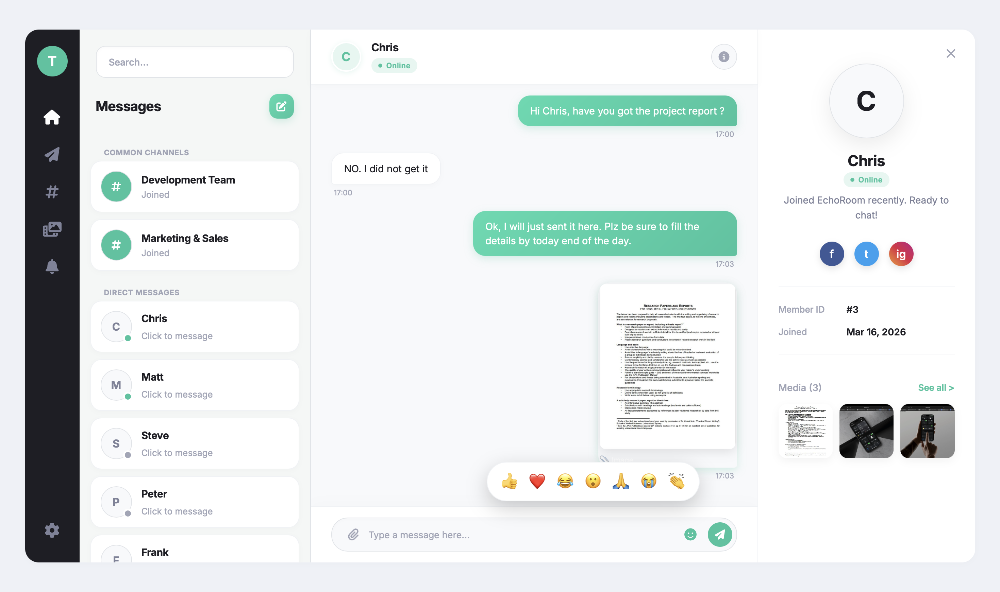
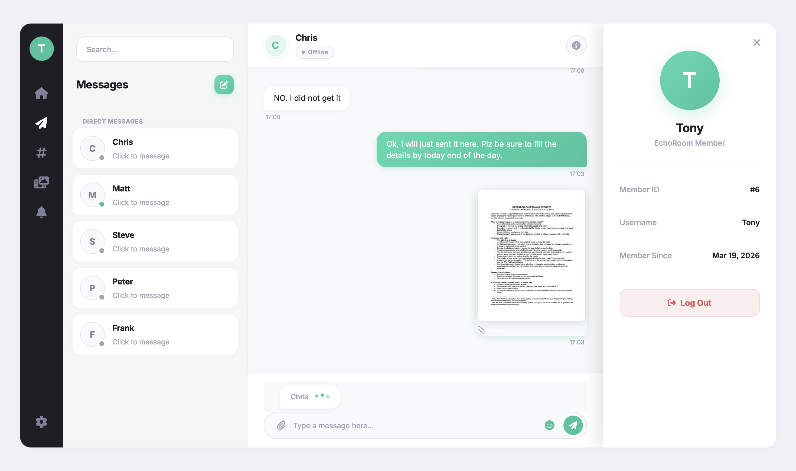
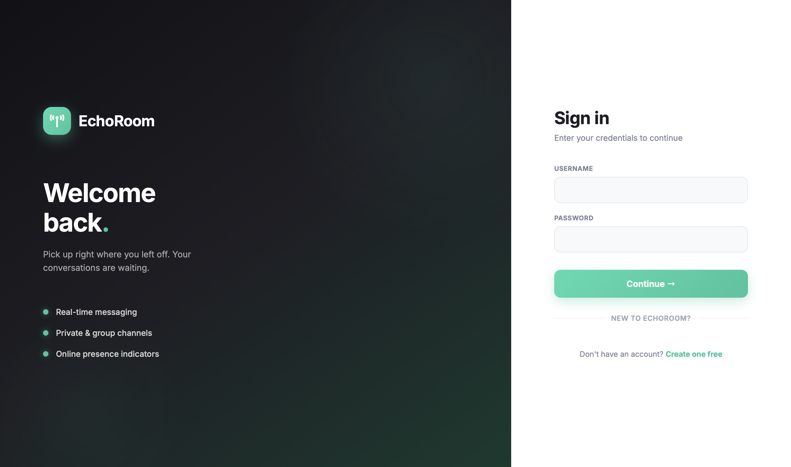

# Echo Room – Real-Time Chat App

A modern real-time chat application built using **Django Channels and WebSockets**, enabling instant messaging, live user status, and media sharing.

---

## Features

- Real-time messaging (no page refresh)
- WebSocket-based communication
- User authentication (login/register)
- Private chats and group channels
- Online/offline user status
- Typing indicators
- Image sharing with media gallery
- Clean and responsive UI

---

## Tech Stack

**Backend:**
- Django  
- Django Channels  
- WebSockets (ASGI)  

**Frontend:**
- HTML  
- CSS  
- JavaScript  

**Database:**
- SQLite (development)

---

## Screenshots

### Chat Interface  


### Settings & Typing Indicator  


### New Chat / Channel


### Login  


---

## Installation

```bash
git clone https://github.com/hemanthchowdary1/echo-room-chat.git
cd echo_room

python -m venv venv
source venv/bin/activate      # Mac/Linux
venv\Scripts\activate         # Windows

pip install -r requirements.txt

python manage.py migrate
python manage.py runserver
```

---

## Usage

- Register or login  
- Select a user or create a channel  
- Start chatting in real-time  
